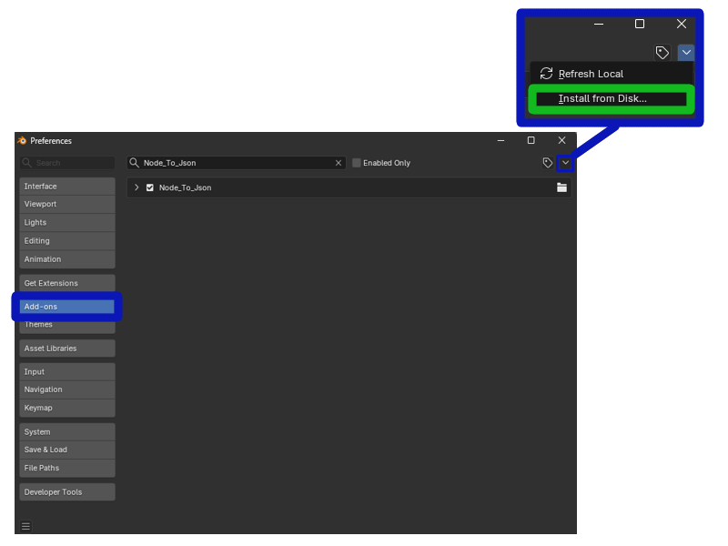
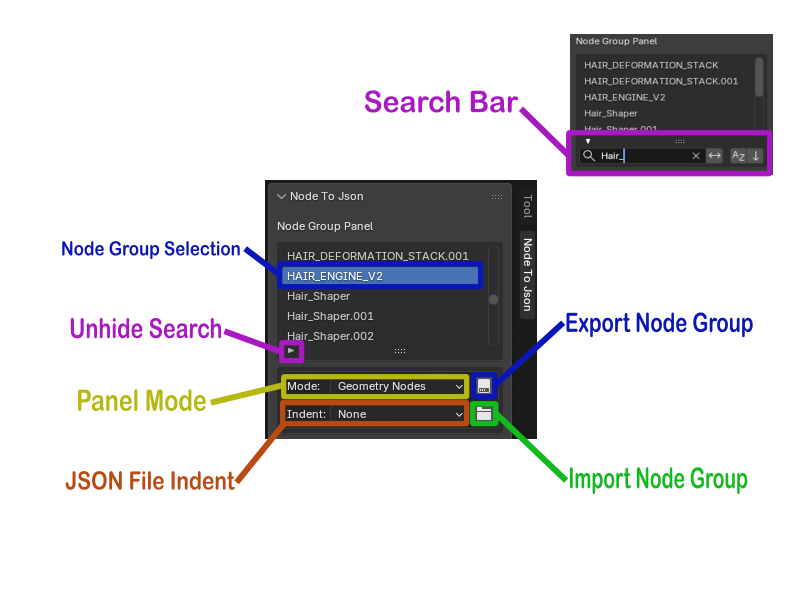

# **Node To Json**
### Add-on for Blender 5.2 to save Node Groups to JSON file and load Node Groups from JSON files.

## **Installation**
### Install from zip as a legacy addon. ==Only download the zip from the release. **Do Not Download** from this page.==
1. Open the ***Preferences*** Panel.
2. Select the ***Add-ons*** tab.
3. Press the ***Install from Disk...*** button.
4. Locate the ***Node To Json.zip*** file and install.

## **USAGE**
### The **Node To Json** Panel is located in the ***Node Editor***.

### **Node Group Selection**
- Available *Node Groups* are displayed and selected by *Node Tree* type in the **Node Group Panel**.

### **Unhide Search**
- Press this button to reveal the ***Search Bar***.
- Type the name of the *Node Group* you are searching for, and the search bar will filter the *Node Groups* by the characters you typed.

### **Panel Mode**
- Select the type of *Node Groups* the you want to search. The ***Node Group Panel*** will display all available *Node Groups* by the *Mode* selected.

### **JSON File Indent**
- Select the amount of spaces to indent the JSON file.
- Useful for viewing the files, but increases the file size.
- It is *recommended* to select **None** to minimumize file size.

### **Import Node Group**
- This button imports a JSON file and builds the *Node Group*.

### **Export Node Group**
- This button exports the *Node Group* to a JSON file.
- It wiil export the selected *Node Group* in the ***Node Group Panel** and use the selected indent amount to create the JSON file.
- You must select a directory to save the file in. The file is automatically named after the selected *Node Group*. If a file is selected for the save directory, the parent directory is used instead.

## **Additional Information**
Included in this Add-on is a **node_to_json.whl** file. It is installed *offline*. It is available for your projects and can be installed through pypi.
> pip install node_to_json

